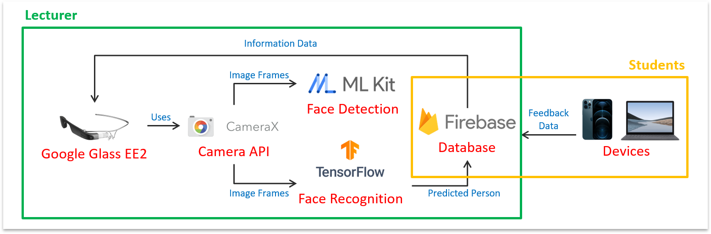

# Classroom-Feedback-System
Classroom Feedback System is a Google Glass project for my Major Project (Final Year Project) during my Diploma studies in Temasek Polytechnic.
It uses a Google Glass-Based Classroom Feedback System to improve Students to Teacher Communication.

## Project Demostration

## System Architecture

## Development Environment
- IDE: Android Studio 
- SDK: Android 8.1 API 27 SDK Platform
- Device: Google Glass Enterprise Edition 2
   - Hardware Profile: \
   [Import](https://developer.android.com/studio/run/managing-avds#importexporthp) this example [hardware profile](https://github.com/googlesamples/glass-enterprise-samples/blob/master/HardwareProfile/glass_ee2_hardware_profile.xml) into Android Virtual Device Manager to make your emulator more like the display on Glass.
